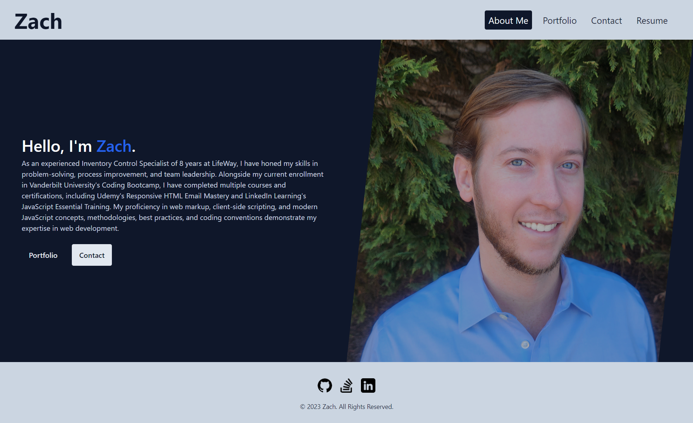

# Portfolio-React

[Deployed Link](https://6500f966d4580509211c87f4--portfolio-react-09122023.netlify.app/)

## Description
A single-page React application showcasing my projects and skills. It also includes an about me section, downloadable resume, and a contact form that uses state to tell the user what is required.

## Table of Contents
- [Usage](#usage)
- [Technologies](#technologies)
- [License](#license)

## Usage
- Visit the site using the following link [Deployed Link](https://6500f966d4580509211c87f4--portfolio-react-09122023.netlify.app/).
- Use the navlinks in the header to navigate to each page.
- In the portfolio section there are clickable icons at the bottom of each project card that will take the user to a deployed sight or the GitHub repo.
- Fill in the required fields in the contact form and enter a valid email.
- Click on the download resume button to view my resume or click on one of my proficiencies to view documentation on it.

## Technologies
[React](https://react.dev/)

[ViteJS](https://vitejs.dev/)

[Tailwind](https://tailwindcss.com/)

## License
This project is licensed under the [MIT](https://opensource.org/licenses/MIT) License.
